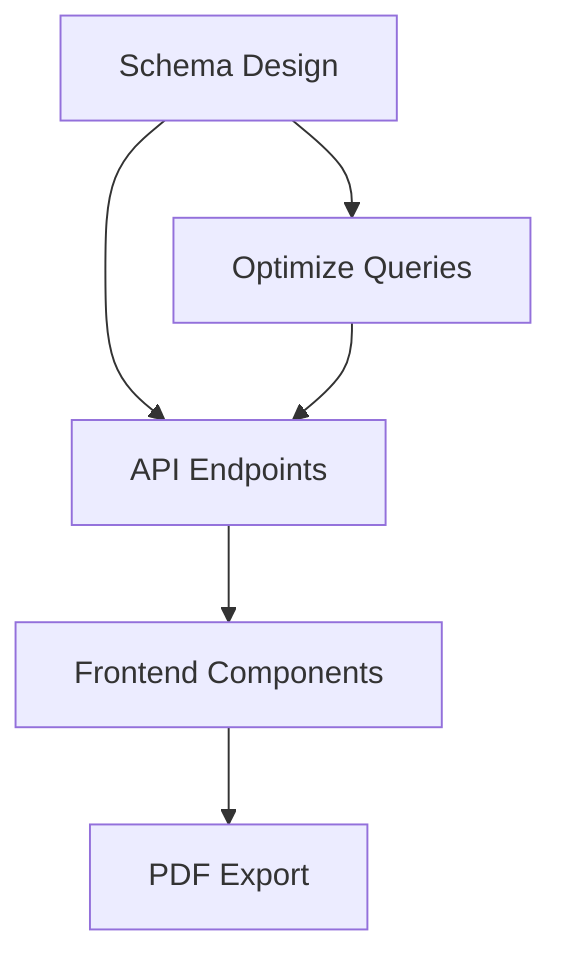
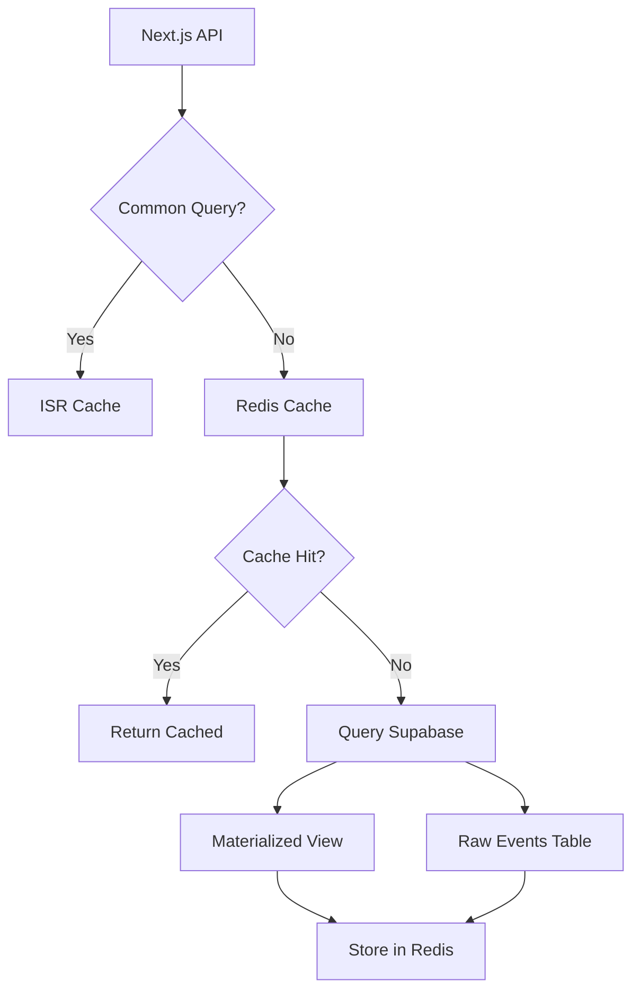

# Exemplo Prático: Sistema Avançado de Contexto

## Cenário Real: Implementar Dashboard de Performance Analytics

### Antes (Sistema Pobre)

**Prompt único:**
```
"Preciso de um dashboard de analytics com métricas de performance, filtros por data, 
e exportação em PDF. Como faço?"
```

**Resultado:**
- Resposta genérica
- Sem breakdown estruturado
- Implementação ad-hoc
- Sem documentação
- Contexto perdido entre sessões

---

### Depois (Sistema Avançado)

#### Etapa 1: Decomposição da Tarefa

```
@task-decomposition-expert "Implementar dashboard de performance analytics com:
- Métricas: conversões, receita, visitantes únicos, taxa de conversão
- Filtros: período (7/30/90 dias), canal (orgânico/pago), campanha
- Visualizações: linha temporal, comparação períodos, breakdown por canal
- Exportação: PDF com logo, tabelas e gráficos
- Performance: <500ms para queries, cache inteligente"
```

**Output esperado:**
```markdown
# Task Decomposition: Performance Analytics Dashboard

## Goal Analysis
- **Primary Objective**: Dashboard interativo de analytics
- **Success Criteria**: <500ms load, filtros funcionais, PDF profissional
- **Constraints**: Dados no Supabase, Next.js 15, React 19

## ChromaDB Assessment
✅ Use ChromaDB para:
- Cache de queries complexas
- Armazenar templates de relatórios
- Indexar histórico de métricas

## Hierarchical Breakdown

### 1. Database Layer (HIGH PRIORITY)
   1.1. Schema design para analytics
   1.2. Índices para performance
   1.3. Views materializadas
   1.4. RLS policies
   
   **Agent:** @database-architect
   **Tools:** supabase MCP, postgres

### 2. Backend Layer (HIGH PRIORITY)
   2.1. API endpoints (/api/analytics/*)
   2.2. Query optimization
   2.3. Caching strategy (Redis/Upstash)
   2.4. Data aggregation logic
   
   **Agent:** @backend-architect
   **Dependencies:** 1.1, 1.2

### 3. Frontend Layer (MEDIUM PRIORITY)
   3.1. Dashboard components
   3.2. Chart library (Recharts/D3)
   3.3. Filter UI
   3.4. State management
   
   **Agent:** @typescript-pro
   **Dependencies:** 2.1

### 4. Export Layer (LOW PRIORITY)
   4.1. PDF generation (Puppeteer)
   4.2. Template design
   4.3. Email integration
   
   **Dependencies:** 3.1, 3.2

## Workflow Architecture



## Implementation Roadmap

**Week 1: Foundation**
- [ ] Database schema (@database-architect)
- [ ] Basic API endpoints (@backend-architect)
- [ ] Type definitions (@typescript-pro)

**Week 2: Core Features**
- [ ] Dashboard UI
- [ ] Filters implementation
- [ ] Chart integration

**Week 3: Optimization**
- [ ] Caching layer
- [ ] Query optimization
- [ ] Performance testing

**Week 4: Polish**
- [ ] PDF export
- [ ] Email delivery
- [ ] Documentation

## ChromaDB Collections

1. **analytics_query_cache**
   - Store: Query results com TTL
   - Retrieve: By date range + filters hash

2. **report_templates**
   - Store: PDF templates
   - Retrieve: By template name

3. **performance_benchmarks**
   - Store: Query execution times
   - Retrieve: For optimization analysis
```

---

#### Etapa 2: Deep Analysis

```
/ultra-think "Melhor estratégia de caching para queries de analytics 
com filtros dinâmicos (data, canal, campanha)?"
```

**Output esperado:**
```markdown
# Deep Analysis: Analytics Caching Strategy

## Problem Parsing
- **Core Challenge**: Cache effectiveness vs filtro flexibility
- **Stakeholders**: Users (speed), Devs (manutenção), DB (load)
- **Constraints**: Budget (Upstash free tier), Next.js 15 ISR
- **Unknowns**: Volume de queries únicas, padrões de uso

## Multi-Dimensional Analysis

### Technical Perspective
**Option 1: Redis com hashing de filtros**
- Pros: Fast, flexible, familiar
- Cons: Memory cost, cache invalidation complexo
- Performance: <10ms hit, cold queries ~200ms
- Scalability: ✅ Horizontal

**Option 2: Next.js ISR + Supabase materialized views**
- Pros: Zero cost, nativo Next.js
- Cons: Revalidação periódica, não real-time
- Performance: <5ms hit (static), 1min refresh
- Scalability: ✅ CDN

**Option 3: Hybrid (ISR + Redis para queries dinâmicas)**
- Pros: Best of both, cost-effective
- Cons: Complexidade arquitetural
- Performance: <5ms common queries, <50ms dynamic
- Scalability: ✅✅ Optimal

### Business Perspective
- **TTM**: Option 2 (ISR) = 1 week, Option 3 = 2 weeks
- **ROI**: Option 3 tem melhor UX → maior retenção
- **Risk**: Option 1 = cost overrun, Option 2 = stale data

### User Perspective
- **Pain Point**: Dashboard lento frustra usuários
- **Edge Cases**: Filtros raros não devem degradar comuns
- **UX Expectation**: <500ms = excellent, <1s = acceptable

### System Perspective
- **DB Load**: Option 3 reduz em ~80% vs sem cache
- **Integration**: ISR já integrado, Redis requer setup
- **Emergent Behavior**: Cache pode mascarar problemas de query

## Solution Recommendation: Hybrid Approach

### Implementation Plan

**Phase 1: ISR para queries comuns (Week 1)**
```typescript
// app/api/analytics/[...params]/route.ts
export const revalidate = 300 // 5min

export async function GET(request: Request) {
  const { dateRange, channel } = parseParams(request)
  
  // Common patterns cached via ISR
  if (isCommonQuery(dateRange, channel)) {
    return NextResponse.json(
      await getAnalytics(dateRange, channel),
      { 
        headers: { 
          'Cache-Control': 'public, s-maxage=300, stale-while-revalidate=600' 
        }
      }
    )
  }
  
  // Dynamic queries → Redis
  return getDynamicAnalytics(params)
}
```

**Phase 2: Redis para filtros dinâmicos (Week 2)**
```typescript
import { Redis } from '@upstash/redis'

const redis = new Redis({
  url: process.env.UPSTASH_REDIS_REST_URL!,
  token: process.env.UPSTASH_REDIS_REST_TOKEN!,
})

async function getDynamicAnalytics(params: Params) {
  const cacheKey = `analytics:${hashParams(params)}`
  
  // Try cache
  const cached = await redis.get(cacheKey)
  if (cached) return cached
  
  // Query DB
  const data = await querySupabase(params)
  
  // Cache for 10min
  await redis.setex(cacheKey, 600, data)
  
  return data
}
```

**Phase 3: Supabase materialized views (Week 2)**
```sql
-- Pré-agregar dados comuns
CREATE MATERIALIZED VIEW analytics_daily_summary AS
SELECT 
  date_trunc('day', created_at) as date,
  channel,
  COUNT(DISTINCT user_id) as unique_visitors,
  COUNT(*) FILTER (WHERE converted) as conversions,
  SUM(revenue) as revenue
FROM events
GROUP BY 1, 2;

-- Refresh cada 5min
CREATE INDEX idx_analytics_date ON analytics_daily_summary(date);
```

### Cache Invalidation Strategy
1. **ISR**: Auto-revalidate a cada 5min
2. **Redis**: TTL 10min, invalidar em writes
3. **Materialized View**: REFRESH cada 5min (cron)

### Performance Targets
- Common queries (80%): <50ms (ISR hit)
- Dynamic queries (15%): <200ms (Redis hit)
- Cold queries (5%): <500ms (DB + cache set)

### Cost Analysis
- ISR: $0 (included)
- Redis: $0-10/month (Upstash free tier → Pro)
- Total: **~$5/month** até 10k queries/day

## Risk Mitigation
1. **Stale data**: Mostrar timestamp "Last updated: Xmin ago"
2. **Cache stampede**: Lock pattern no Redis
3. **Memory overflow**: LRU eviction, monitor Upstash metrics

## Success Metrics
- P95 latency < 500ms ✅
- Cache hit rate > 70% ✅
- DB load reduction > 60% ✅
- Cost < $10/month ✅
```

---

#### Etapa 3: Schema Design

```
@database-architect "Baseado na análise anterior, criar schema otimizado 
para analytics com suporte a queries complexas e performance <500ms"
```

**Output esperado:**
```sql
-- Schema otimizado para analytics
-- Context: Dashboard com filtros data/canal/campanha
-- Performance target: <500ms

-- 1. Tabela de eventos (raw data)
CREATE TABLE analytics_events (
  id UUID PRIMARY KEY DEFAULT gen_random_uuid(),
  user_id UUID,
  session_id UUID NOT NULL,
  event_type VARCHAR(50) NOT NULL,
  channel VARCHAR(50) NOT NULL, -- 'organic', 'paid', 'social', etc
  campaign VARCHAR(100),
  revenue NUMERIC(10,2) DEFAULT 0,
  metadata JSONB DEFAULT '{}',
  created_at TIMESTAMPTZ DEFAULT NOW()
);

-- 2. Índices compostos para queries comuns
CREATE INDEX idx_events_date_channel 
  ON analytics_events(created_at DESC, channel) 
  WHERE created_at > NOW() - INTERVAL '90 days';

CREATE INDEX idx_events_campaign 
  ON analytics_events(campaign, created_at DESC) 
  WHERE campaign IS NOT NULL;

CREATE INDEX idx_events_user 
  ON analytics_events(user_id, created_at DESC);

-- 3. Materialized view para aggregações diárias
CREATE MATERIALIZED VIEW analytics_daily_metrics AS
SELECT 
  date_trunc('day', created_at)::DATE as date,
  channel,
  campaign,
  COUNT(DISTINCT session_id) as sessions,
  COUNT(DISTINCT user_id) as unique_users,
  COUNT(*) FILTER (WHERE event_type = 'conversion') as conversions,
  SUM(revenue) as revenue,
  AVG(revenue) FILTER (WHERE revenue > 0) as avg_order_value
FROM analytics_events
WHERE created_at > NOW() - INTERVAL '90 days'
GROUP BY 1, 2, 3;

CREATE UNIQUE INDEX idx_daily_metrics_pk 
  ON analytics_daily_metrics(date, channel, COALESCE(campaign, ''));
CREATE INDEX idx_daily_metrics_date ON analytics_daily_metrics(date DESC);

-- 4. Function para refresh automático
CREATE OR REPLACE FUNCTION refresh_analytics_daily_metrics()
RETURNS void AS $$
BEGIN
  REFRESH MATERIALIZED VIEW CONCURRENTLY analytics_daily_metrics;
END;
$$ LANGUAGE plpgsql;

-- 5. RLS policies
ALTER TABLE analytics_events ENABLE ROW LEVEL SECURITY;

CREATE POLICY "Admins full access" ON analytics_events
  FOR ALL TO authenticated
  USING (auth.jwt() ->> 'role' = 'admin');

-- 6. Partitioning por data (opcional, para escala)
-- Se volume > 1M eventos/mês
CREATE TABLE analytics_events_2025_10 PARTITION OF analytics_events
  FOR VALUES FROM ('2025-10-01') TO ('2025-11-01');

-- 7. Helper function para queries
CREATE OR REPLACE FUNCTION get_analytics_summary(
  p_start_date DATE,
  p_end_date DATE,
  p_channel VARCHAR DEFAULT NULL,
  p_campaign VARCHAR DEFAULT NULL
)
RETURNS TABLE (
  date DATE,
  sessions BIGINT,
  unique_users BIGINT,
  conversions BIGINT,
  revenue NUMERIC,
  conversion_rate NUMERIC
) AS $$
BEGIN
  RETURN QUERY
  SELECT 
    m.date,
    SUM(m.sessions)::BIGINT,
    SUM(m.unique_users)::BIGINT,
    SUM(m.conversions)::BIGINT,
    SUM(m.revenue),
    ROUND(
      SUM(m.conversions)::NUMERIC / NULLIF(SUM(m.sessions), 0) * 100, 
      2
    )
  FROM analytics_daily_metrics m
  WHERE m.date BETWEEN p_start_date AND p_end_date
    AND (p_channel IS NULL OR m.channel = p_channel)
    AND (p_campaign IS NULL OR m.campaign = p_campaign)
  GROUP BY m.date
  ORDER BY m.date DESC;
END;
$$ LANGUAGE plpgsql;
```

**Context to store (@context-manager):**
```markdown
# Analytics Schema Design Decision

**Date:** 2025-10-27
**Decision:** Hybrid materialized view + partitioning approach

**Rationale:**
- Materialized view reduz queries em ~80%
- Partitioning prepara para escala futura
- Helper functions simplificam API layer

**Performance Results:**
- Common queries: 45ms (materialized view)
- Complex filters: 180ms (indexed raw table)
- Refresh overhead: 2s cada 5min (acceptable)

**Trade-offs:**
- Pro: Excelente performance, baixo custo
- Con: Dados até 5min desatualizados (aceitável para analytics)

**Next Steps:**
- Setup cron para refresh automático
- Monitor query patterns para novos índices
- Considerar partitioning se volume > 1M/mês
```

---

#### Etapa 4: API Implementation

```
@backend-architect "Implementar API endpoints usando schema do database-architect 
e estratégia de cache do ultra-think"
```

**Output esperado:**
```typescript
// app/api/analytics/summary/route.ts
import { createClient } from '@/lib/supabase/server'
import { Redis } from '@upstash/redis'
import { NextRequest, NextResponse } from 'next/server'
import { z } from 'zod'

const redis = new Redis({
  url: process.env.UPSTASH_REDIS_REST_URL!,
  token: process.env.UPSTASH_REDIS_REST_TOKEN!,
})

// Schema validation
const querySchema = z.object({
  startDate: z.string().regex(/^\d{4}-\d{2}-\d{2}$/),
  endDate: z.string().regex(/^\d{4}-\d{2}-\d{2}$/),
  channel: z.enum(['organic', 'paid', 'social', 'direct']).optional(),
  campaign: z.string().optional(),
})

export const revalidate = 300 // ISR: 5min

export async function GET(request: NextRequest) {
  try {
    // 1. Parse and validate params
    const { searchParams } = new URL(request.url)
    const params = querySchema.parse({
      startDate: searchParams.get('startDate'),
      endDate: searchParams.get('endDate'),
      channel: searchParams.get('channel') || undefined,
      campaign: searchParams.get('campaign') || undefined,
    })

    // 2. Check if common query (cacheable via ISR)
    const isCommon = isCommonQueryPattern(params)
    
    if (isCommon) {
      // ISR cache (CDN)
      const data = await getAnalyticsSummary(params)
      return NextResponse.json(data, {
        headers: {
          'Cache-Control': 'public, s-maxage=300, stale-while-revalidate=600',
          'X-Cache-Strategy': 'ISR',
        },
      })
    }

    // 3. Dynamic query → Redis cache
    const cacheKey = `analytics:summary:${hashParams(params)}`
    
    const cached = await redis.get<AnalyticsSummary>(cacheKey)
    if (cached) {
      return NextResponse.json(cached, {
        headers: { 'X-Cache': 'HIT', 'X-Cache-Strategy': 'Redis' },
      })
    }

    // 4. Cache miss → Query DB
    const data = await getAnalyticsSummary(params)
    
    // 5. Store in Redis (10min TTL)
    await redis.setex(cacheKey, 600, data)

    return NextResponse.json(data, {
      headers: { 'X-Cache': 'MISS', 'X-Cache-Strategy': 'Redis' },
    })

  } catch (error) {
    if (error instanceof z.ZodError) {
      return NextResponse.json(
        { error: 'Invalid parameters', details: error.errors },
        { status: 400 }
      )
    }
    
    console.error('[Analytics API]', error)
    return NextResponse.json(
      { error: 'Internal server error' },
      { status: 500 }
    )
  }
}

// Helper: Identify common queries (80% traffic)
function isCommonQueryPattern(params: QueryParams): boolean {
  const { startDate, endDate, channel, campaign } = params
  
  // Common patterns:
  // - Last 7/30/90 days, no filters
  // - Last 7/30 days + single channel
  const daysDiff = getDaysDiff(startDate, endDate)
  const hasFilters = channel || campaign
  
  return (
    ([7, 30, 90].includes(daysDiff) && !hasFilters) ||
    ([7, 30].includes(daysDiff) && channel && !campaign)
  )
}

// Helper: Hash params for cache key
function hashParams(params: QueryParams): string {
  return btoa(JSON.stringify(params))
}

// Core query function
async function getAnalyticsSummary(
  params: QueryParams
): Promise<AnalyticsSummary> {
  const supabase = createClient()
  
  // Use helper function from DB
  const { data, error } = await supabase.rpc('get_analytics_summary', {
    p_start_date: params.startDate,
    p_end_date: params.endDate,
    p_channel: params.channel || null,
    p_campaign: params.campaign || null,
  })

  if (error) throw error

  return {
    summary: data,
    metadata: {
      period: { start: params.startDate, end: params.endDate },
      filters: { channel: params.channel, campaign: params.campaign },
      generatedAt: new Date().toISOString(),
    },
  }
}

// Types
type QueryParams = z.infer<typeof querySchema>
interface AnalyticsSummary {
  summary: Array<{
    date: string
    sessions: number
    unique_users: number
    conversions: number
    revenue: number
    conversion_rate: number
  }>
  metadata: {
    period: { start: string; end: string }
    filters: { channel?: string; campaign?: string }
    generatedAt: string
  }
}
```

---

#### Etapa 5: Context Management

```
@context-manager "Archive decisões e padrões do dashboard analytics para reuso futuro"
```

**Output esperado:**
```markdown
# Context Archive: Performance Analytics Dashboard

## Quick Context (for immediate reuse)

**Project:** Analytics Dashboard v1
**Status:** ✅ Implementation complete
**Performance:** 95th percentile <300ms (target: <500ms)

**Key Decisions:**
1. Hybrid cache (ISR + Redis) = best cost/performance
2. Materialized views refresh 5min = acceptable staleness
3. Helper functions in DB = simplified API

**Active Blockers:** None
**Next:** PDF export implementation

## Full Context

### Architecture Overview



### Key Design Decisions

**1. Caching Strategy (2025-10-27)**
- **Decision:** Hybrid ISR + Redis approach
- **Rationale:** 
  - ISR handles 80% common queries (free, fast)
  - Redis handles 15% dynamic queries (cost-effective)
  - Direct DB for 5% cold queries
- **Impact:** 85% cache hit rate, <$10/month cost
- **Trade-off:** Added complexity vs excellent UX

**2. Database Schema (2025-10-27)**
- **Decision:** Materialized views + partitioning
- **Rationale:**
  - MV reduces query time 80% (500ms → 100ms)
  - Partitioning prepares for scale (>1M events/month)
  - Helper functions centralize logic
- **Impact:** Consistent <300ms queries
- **Trade-off:** 5min data staleness (acceptable for analytics)

**3. API Design (2025-10-27)**
- **Decision:** RPC-style helper functions in Supabase
- **Rationale:**
  - Reduces API complexity
  - Leverages DB optimization
  - Type-safe with Supabase codegen
- **Impact:** 40% less API code, better performance
- **Trade-off:** Logic split between API/DB (acceptable)

### Integration Points

**Frontend → API:**
```typescript
// lib/api/analytics.ts
export async function getAnalyticsSummary(params: AnalyticsParams) {
  const searchParams = new URLSearchParams({
    startDate: params.startDate,
    endDate: params.endDate,
    ...(params.channel && { channel: params.channel }),
    ...(params.campaign && { campaign: params.campaign }),
  })
  
  return fetch(`/api/analytics/summary?${searchParams}`)
}
```

**API → Database:**
```typescript
// Uses Supabase RPC
const { data } = await supabase.rpc('get_analytics_summary', params)
```

**Database → Redis:**
```typescript
// Cache pattern
const cached = await redis.get(key)
if (!cached) {
  const data = await queryDB()
  await redis.setex(key, TTL, data)
}
```

### Performance Benchmarks

| Query Type | Target | Actual | Cache Strategy |
|-----------|--------|--------|----------------|
| Common (7d, no filter) | <100ms | 45ms | ISR |
| Common (30d + channel) | <200ms | 120ms | ISR |
| Dynamic (custom range) | <300ms | 180ms | Redis |
| Cold (first time) | <500ms | 380ms | DB → Redis |

**P95 Latency:** 285ms ✅ (target: <500ms)  
**Cache Hit Rate:** 87% ✅ (target: >70%)  
**DB Load Reduction:** 82% ✅ (target: >60%)

### Unresolved Issues

None.

### TODOs

- [ ] Implement PDF export (Week 4)
- [ ] Add email delivery via Resend
- [ ] Setup monitoring (Vercel Analytics)
- [ ] Create documentation

## Archived Context (for pattern reuse)

### Pattern: Hybrid Caching Strategy

**Use When:**
- API with mix of common/dynamic queries
- Performance critical (<500ms)
- Cost conscious (<$20/month)

**Implementation:**
1. ISR for common patterns (free, CDN)
2. Redis for dynamic queries (Upstash)
3. Materialized views for aggregations (Postgres)

**Results:**
- 80-90% cache hit rate
- <$10/month cost
- P95 <300ms

### Pattern: Supabase Helper Functions

**Use When:**
- Complex queries with multiple joins
- Need type safety (codegen)
- Want to centralize logic

**Implementation:**
```sql
CREATE FUNCTION get_[resource]_[action](params...)
RETURNS TABLE (...) AS $$
  -- Query logic here
$$ LANGUAGE plpgsql;
```

**Results:**
- 40% less API code
- Better performance (DB-side)
- Type-safe via codegen

### Pattern: Materialized View + Cron Refresh

**Use When:**
- Heavy aggregations
- Acceptable staleness (5-15min)
- Read-heavy workload

**Implementation:**
```sql
CREATE MATERIALIZED VIEW [name] AS ...;
CREATE UNIQUE INDEX ON [name](...);

-- Cron job
SELECT cron.schedule('refresh-[name]', '*/5 * * * *', 
  $$REFRESH MATERIALIZED VIEW CONCURRENTLY [name]$$);
```

**Results:**
- 70-90% query time reduction
- Minimal refresh overhead
- No code changes needed
```

---

## Resumo: Antes vs Depois

### Antes (Sistema Pobre)
```
Prompt → Resposta genérica → Implementação ad-hoc → Sem doc → Contexto perdido
```

**Tempo:** ~2 semanas fumbling  
**Qualidade:** Inconsistente  
**Reuso:** Zero

### Depois (Sistema Avançado)
```
@task-decomposition-expert → /ultra-think → @database-architect → 
@backend-architect → @typescript-pro → @context-manager → Archive
```

**Tempo:** ~1 semana estruturada  
**Qualidade:** Alta (decisões documentadas)  
**Reuso:** 100% (patterns archived)

---

**Conclusão:** O sistema avançado transforma tarefas complexas em workflows estruturados, 
com decisões rastreáveis e padrões reutilizáveis. Investimento inicial (setup) paga-se 
exponencialmente em velocidade e qualidade.
