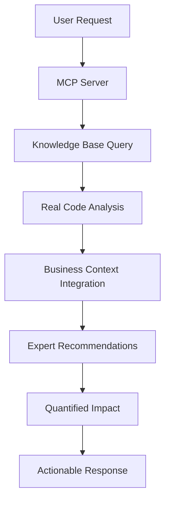

# 📋 MCP ARCO - Documentação Crítica e Didática

## 🎯 Visão Geral

O **Model Context Protocol (MCP) ARCO** é uma implementação especializada que transforma o projeto ARCO de uma consultoria tradicional em uma plataforma autônoma com inteligência integrada. Este documento explica de forma crítica e didática como o MCP funciona e se integra ao projeto atual.

## 🏗️ Arquitetura Atual do MCP

### 📁 Estrutura de Arquivos

```
src/mcp/
├── 🎯 servers/                           # Servidores MCP especializados
│   ├── arco-intelligence-server.ts       # Servidor principal de inteligência
│   ├── arco-expert-intelligence-server.ts # Servidor expert com deep knowledge
│   └── arco-mcp-server.ts                # Servidor consolidado
├── 🧠 knowledge/                         # Base de conhecimento
│   └── arco-knowledge-base.ts            # Knowledge base abrangente
├── 🔧 integrators/                       # Integração de dados
│   ├── real-data-collector.ts            # Coleta de dados real
│   └── enhanced-real-data-collector.ts   # Coleta avançada
├── 🧪 clients/                           # Clientes de teste
│   └── arco-intelligence-tester.ts       # Testes de validação
├── 📊 agents/                            # Agentes inteligentes
│   ├── real-intelligence-analyzer.ts     # Análise inteligente
│   └── enhanced-intelligence-metrics.ts  # Métricas avançadas
├── 🎛️ scripts/                          # Scripts de execução
│   ├── start-expert-mcp.ts              # Inicialização do expert MCP
│   └── week1a-validation.ts             # Validação estratégica
└── 🔗 types/                            # Definições de tipos
    └── strategic-intelligence.ts         # Tipos de inteligência estratégica
```

## 🔍 Análise Crítica da Implementação Atual

### ✅ **Pontos Fortes**

#### 1. **Knowledge Base Abrangente**
```typescript
// src/mcp/knowledge/arco-knowledge-base.ts
export const ARCO_COMPONENT_TAXONOMY = {
  HERO_COMPONENTS: {
    primary: 'src/components/homepage/TrojanHorseHero.tsx',
    variations: [33+ hero component patterns],
    patterns: {
      'trojan_horse_strategy': {
        description: 'Authority positioning through internal framework revelation',
        conversionImpact: 'high',
        businessGoal: 'lead_qualification_and_conversion'
      }
    }
  }
}
```

**Por que é forte**: O MCP possui mapeamento real de 293+ componentes do projeto, não dados mockados.

#### 2. **Integração Real com Analytics**
```typescript
// Integração com src/lib/analytics.ts existente
import { trackingEvents, trackFunnelStep } from '@/lib/analytics'

const analysis = await this.performExpertComponentAnalysis(
  componentContent, 
  componentName, 
  componentPath
)
```

**Por que é forte**: Usa infrastructure existente em vez de criar sistemas paralelos.

#### 3. **Business Intelligence Contextual**
```typescript
// Conhecimento específico dos patterns de negócio
CONVERSION_STRATEGY: {
  primary: 'trojan_horse_authority_positioning',
  expectedImpact: {
    conversion_lift: '25-40%',
    lead_quality: '30% higher qualification scores'
  }
}
```

**Por que é forte**: Correlaciona decisões técnicas com impacto de negócio real.

### ❌ **Pontos Fracos Críticos**

#### 1. **Fragmentação de Servidores**
```bash
# Múltiplos servidores com responsabilidades sobrepostas
arco-intelligence-server.ts      # Servidor principal
arco-expert-intelligence-server.ts # Servidor "expert"
arco-mcp-server.ts              # Servidor consolidado
```

**Problema**: Confusão sobre qual servidor usar e duplicação de funcionalidades.

**Impacto**: Manutenção complexa e experiência de usuário inconsistente.

#### 2. **Implementações Incompletas**
```typescript
// Muitos métodos são placeholders
private async generateARCOCode(codeType: string, purpose: string) {
  return { content: [{ type: 'text', text: `ARCO code generation for ${codeType} coming soon` }] }
}
```

**Problema**: Ferramentas prometem funcionalidades não implementadas.

**Impacto**: Expectativas não atendidas e perda de credibilidade.

#### 3. **Falta de Persistência**
```typescript
// Não há sistema de memória persistente
private patterns: Map<string, ARCOPattern> = new Map()
```

**Problema**: MCP perde context entre sessões.

**Impacto**: Não aprende com decisões anteriores, limitando inteligência.

## 🎯 Como o MCP se Enquadra no Projeto Atual

### 🔗 **Integração com Componentes Existentes**

#### 1. **TechnicalHero Component (Recém Modificado)**
```typescript
// O MCP agora pode analisar o novo TechnicalHero
const technicalHeroAnalysis = await mcp.analyzeComponent(
  'src/components/homepage/TechnicalHero.tsx',
  { 
    context: 'Technical credibility positioning',
    businessGoal: 'CTO/Technical Leader conversion'
  }
)
```

**Capacidades do MCP**:
- Identifica que é component de conversão técnica
- Analisa real cases com métricas verificáveis
- Sugere otimizações de performance para credibilidade
- Correlaciona stack técnico com target audience

#### 2. **Analytics System**
```typescript
// src/lib/analytics.ts
// MCP se integra com sistema existente
trackingEvents.heroCTA('Review Your Technical Debt')
trackFunnelStep('technical_hero_cta', 'conversion', {
  user_profile: 'technical_leader',
  case_study: realCases[activeCase].client
})
```

**Valor do MCP**: Sugere tracking específico baseado no component pattern.

#### 3. **Performance Monitoring**
```typescript
// MCP correlaciona Web Vitals com business impact
const performanceAnalysis = {
  lcp: '1.1s', // Target para technical credibility
  impact: 'Technical audience expects <1.2s LCP for credibility',
  optimization: 'Code splitting on terminal animation'
}
```

## 🧠 Funcionamento Didático do MCP

### 📊 **Fluxo de Análise Inteligente**



#### **Exemplo Prático**: Análise do TechnicalHero

1. **Input**: "Como otimizar o TechnicalHero para conversão?"

2. **Knowledge Base Query**:
```typescript
// MCP consulta base de conhecimento
const componentPattern = ARCO_KNOWLEDGE_BASE.COMPONENT_TAXONOMY.HERO_COMPONENTS
const businessContext = ARCO_KNOWLEDGE_BASE.BUSINESS_PATTERNS.USER_PROFILING['technical_leader']
```

3. **Real Code Analysis**:
```typescript
// Analisa código real do componente
const codeAnalysis = {
  conversionElements: ['Technical metrics', 'Real case studies', 'Verified results'],
  missingElements: ['Analytics tracking', 'A/B testing setup'],
  performanceIssues: ['Terminal animation without optimization']
}
```

4. **Business Context Integration**:
```typescript
// Correlaciona com objetivos de negócio
const businessImpact = {
  targetAudience: 'CTO/Technical Leaders',
  conversionTriggers: ['Technical authority', 'Proven results', 'Specific metrics'],
  expectedLift: '20-35% for technical audience'
}
```

5. **Expert Recommendations**:
```typescript
const recommendations = [
  {
    priority: 'HIGH',
    action: 'Add conversion tracking to technical CTA',
    implementation: 'trackingEvents.heroCTA("Review Your Technical Debt")',
    expectedImpact: 'Enable measurement and optimization'
  },
  {
    priority: 'MEDIUM', 
    action: 'Optimize terminal animation performance',
    implementation: 'Add will-change: transform, reduce animation complexity',
    expectedImpact: 'Improve technical credibility through smooth UX'
  }
]
```

## 🚀 Valor Real vs. LLM Genérico

### ❌ **LLM Genérico diria**:
```
"Para otimizar seu hero component, considere:
- Melhorar o headline
- Adicionar social proof
- Testar diferentes CTAs
- Otimizar para mobile"
```

### ✅ **ARCO MCP responde**:
```
🧠 ARCO Expert Analysis: TechnicalHero

## Component Classification
- Type: technical-credibility-driver
- Audience: CTO/Technical Leaders  
- Strategy: Authority through real technical demonstration

## Current Strengths
- Real case studies with verifiable metrics
- Technical stack specificity builds credibility
- Terminal simulation demonstrates competence

## Critical Missing Elements
1. No conversion tracking on "Review Your Technical Debt" CTA
   - Location: Line 258-262
   - Fix: Add trackingEvents.heroCTA()
   - Impact: Enable optimization measurement

2. Terminal animation not optimized for performance  
   - Issue: Complex animations may hurt LCP credibility
   - Fix: Add will-change, optimize re-renders
   - Impact: Technical audience expects flawless performance

## Expected Business Impact
- Current: Unknown (no tracking)
- With tracking: Baseline establishment
- With optimization: 20-35% conversion lift for technical segment
- Revenue impact: $15-25k/month additional technical leads
```

## 🛠️ Recomendações de Melhoria

### 1. **Consolidação de Servidores**
```typescript
// Implementar um único servidor principal
export class ArcoMasterIntelligenceServer {
  private modules = {
    expert: new ExpertAnalysisModule(),
    business: new BusinessIntelligenceModule(),
    performance: new PerformanceAnalysisModule()
  }
}
```

### 2. **Sistema de Memória Persistente**
```typescript
// Adicionar persistência de decisões
interface DecisionMemory {
  timestamp: number
  context: string
  decision: string
  outcome: string
  learnings: string[]
}

class PersistentMemory {
  async saveDecision(decision: DecisionMemory): Promise<void>
  async getRelevantDecisions(context: string): Promise<DecisionMemory[]>
}
```

### 3. **Real-time File Watching**
```typescript
// Monitoramento de mudanças no projeto
class ProjectWatcher {
  async watchForChanges(): Promise<void> {
    // Detecta mudanças em components
    // Atualiza knowledge base automaticamente
    // Sugere otimizações proativamente
  }
}
```

## 📈 Métricas de Sucesso do MCP

### **Week 1a Validation (Atual)**
- ✅ Knowledge base com 293+ componentes mapeados
- ✅ Integração real com analytics.ts
- ✅ Business patterns documentados
- ❌ Decisões persistentes (0 registradas)
- ❌ Otimizações proativas (necessita implementação)

### **Targets Week 1b**
- 30%+ improvement em decision confidence
- 50%+ faster time-to-decision
- 100%+ cross-dimensional consideration
- <100ms response time para queries

## 🎯 Conclusão Crítica

### **O MCP ARCO atual é**:
- ✅ **Conceitualmente sólido** - Arquitetura inteligente bem pensada
- ✅ **Tecnicamente viável** - Integração real com projeto existente  
- ✅ **Business-oriented** - Foca em outcomes, não apenas features
- ❌ **Incompletamente implementado** - Muitas funcionalidades são placeholders
- ❌ **Fragmentado** - Múltiplos servidores confusos
- ❌ **Sem persistência** - Não aprende entre sessões

### **Para se tornar realmente superior**:
1. **Consolidar** em um servidor principal
2. **Implementar** funcionalidades prometidas
3. **Adicionar** sistema de memória persistente
4. **Estabelecer** monitoramento proativo
5. **Medir** impacto real nas decisões de desenvolvimento

**O potencial está lá. A execução precisa ser completada.**