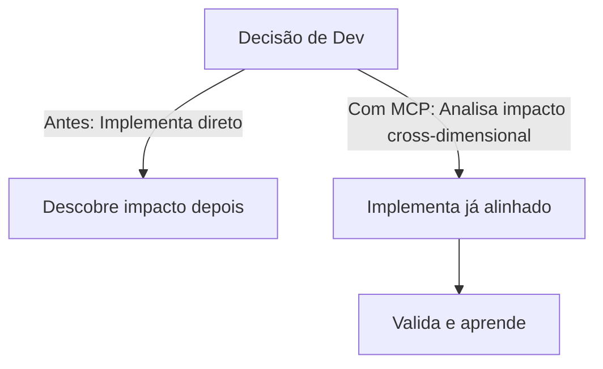

# Integração do MCP (Model Context Protocol) no Projeto ARCO

## Visão Geral

O MCP (Model Context Protocol) é o "sistema nervoso central" da plataforma ARCO, responsável por integrar, analisar e orquestrar dados reais de múltiplas fontes (performance, leads, inteligência competitiva, métricas de negócio) para transformar decisões estratégicas e operacionais em vantagem competitiva sustentável.

---

## 1. Por que o MCP é essencial?

- **Elimina simulação e heurísticas frágeis**: substitui Math.random() e lógicas simuladas por análise baseada em dados reais, históricos e modelos de machine learning.
- **Centraliza o contexto**: unifica dados técnicos, de negócio e competitivos em um só núcleo, permitindo decisões cross-dimensionais.
- **Automatiza inteligência**: recomenda roadmap, otimizações, alocação de recursos e diferenciação competitiva de forma autônoma.
- **Facilita validação e evolução**: permite testes automatizados, validação de hipóteses e evolução contínua da inteligência da plataforma.

---

## 2. Como o MCP está integrado ao ARCO

### a) Estrutura de Diretórios

- `src/mcp/servers/arco-intelligence-server.ts`: Servidor principal MCP, expõe APIs/contextos e integra todos os agentes/inteligências.
- `src/mcp/agents/real-intelligence-metrics.ts`: Calculadora de métricas reais (impacto, risco, valor, ROI, etc.) baseada em dados reais e ML.
- `src/mcp/integrators/real-data-collector.ts`: Coleta dados reais de produção (analytics, leads, performance, etc.).
- `src/mcp/clients/arco-intelligence-tester.ts`: Cliente de teste automatizado para validação end-to-end.

### b) Fluxo de Dados

1. **Coleta**: O `real-data-collector.ts` integra com APIs externas (Vercel Analytics, Web Vitals, leads, etc.) e armazena dados reais.
2. **Cálculo**: O `real-intelligence-metrics.ts` processa esses dados, aplicando modelos estatísticos/ML para gerar métricas confiáveis.
3. **Análise**: O `arco-intelligence-server.ts` orquestra a análise cross-dimensional, respondendo a queries e sugerindo ações estratégicas.
4. **Validação**: O `arco-intelligence-tester.ts` executa cenários de teste, garantindo que a inteligência é real e robusta.

### c) Substituição de Simulação

- Todas as funções core que usavam Math.random() ou heurísticas foram refatoradas para usar o sistema unificado de métricas reais.
- Fallbacks inteligentes garantem robustez mesmo quando dados reais são escassos.

---

## 3. Benefícios Práticos

- **Decisão baseada em fatos**: Roadmap, priorização e recomendações são baseadas em dados reais, não em achismos.
- **Vantagem competitiva defensável**: O MCP permite responder mais rápido e melhor que consultorias tradicionais.
- **Automação e escalabilidade**: O sistema pode evoluir para automação total de otimização, resposta competitiva e reporting executivo.
- **Validação contínua**: Scripts e clientes automatizados garantem que a inteligência está sempre funcionando e evoluindo.

---

## 4. Recomendações para Evolução

1. **Expandir integrações reais**: Conectar mais fontes (ex: CRM, dados de vendas, APIs de mercado).
2. **Aprimorar modelos de ML**: Evoluir de heurísticas para modelos preditivos e de correlação real.
3. **Automatizar dashboards executivos**: Expor insights e recomendações em tempo real para tomada de decisão.
4. **Endurecer para produção**: Monitoramento, segurança, tratamento de erros e escalabilidade.
5. **Documentar e medir ganhos**: Registrar melhorias de performance, qualidade de decisão e ROI.

---

## 5. Lições Críticas do Processo

- **Validação incremental é essencial**: Refatorações profundas devem ser validadas a cada etapa.
- **Async/await e tipagem exigem atenção**: Mudanças em funções core exigem revisão de todos os pontos de chamada.
- **Build limpo antes de celebrar sucesso**: Só documentar sucesso após garantir build e testes 100% limpos.

---

## 6. Próximos Passos Sugeridos

- Rodar build e testes automatizados.
- Validar respostas do MCP na prática (testes end-to-end).
- Integrar mais dados reais e evoluir modelos.
- Consolidar dashboards e reporting executivo.
- Garantir robustez, segurança e escalabilidade para produção.

---

## 7. Conclusão

A integração do MCP transforma o ARCO em uma plataforma de inteligência estratégica real, capaz de gerar vantagem competitiva sustentável, automatizar decisões e evoluir continuamente. O próximo ciclo deve focar em integração total de dados, automação e reporting executivo para consolidar o diferencial do projeto.

---

# COMO O MCP CONTRIBUI PARA O DESENVOLVIMENTO DO ARCO

## 1. O MCP como Acelerador de Decisão e Qualidade

O MCP não é um "AI empire" ou um sistema autônomo que substitui humanos. Ele é uma camada de inteligência que:

- **Conecta decisões técnicas, comerciais e competitivas em tempo real**.
- **Permite que cada decisão de desenvolvimento seja informada por múltiplas dimensões** (performance, conversão, diferenciação, risco, recursos, etc.).
- **Reduz o ciclo de feedback**: você não precisa esperar semanas para descobrir o impacto de uma decisão; o MCP antecipa implicações e recomendações imediatamente.

## 2. Exemplo Prático: Antes vs. Depois do MCP

```typescript
// Antes (ciclo tradicional)
Decisão → Implementa → Descobre impacto (tarde) → Ajusta (rework)

// Com MCP
Decisão → Analisa impacto cross-dimensional → Implementa já considerando riscos e oportunidades → Valida resultado
```

- **Resultado:** Menos retrabalho, decisões mais rápidas, entregas que já nascem alinhadas ao negócio e ao mercado.

## 3. Como o MCP se Encaixa no Workflow do ARCO

- **VS Code Integration:** Comandos como "ARCO: Analyze Decision" trazem contexto cross-dimensional direto no editor.
- **Testes automatizados:** Scripts MCP validam se decisões realmente melhoram múltiplas dimensões.
- **Hooks de commit:** Análises MCP podem ser integradas ao fluxo de git para sugerir melhorias antes do código ir para produção.
- **Contexto em tempo real:** O MCP pode ser consultado a qualquer momento para analisar decisões, features, estratégias de conteúdo ou ajustes técnicos.

## 4. Benefícios Concretos para o Projeto

- **Acelera o desenvolvimento:** Menos tempo perdido com decisões isoladas ou retrabalho.
- **Aumenta a qualidade:** Cada entrega já considera performance, conversão, diferenciação e riscos.
- **Alinha tecnologia ao negócio:** O roadmap técnico é guiado por impacto comercial e posicionamento competitivo.
- **Facilita validação executiva:** Métricas e insights do MCP podem ser usados em reuniões, propostas e acompanhamento de resultados.
- **Aprendizado composto:** Cada decisão e resultado alimenta o contexto, tornando o sistema mais inteligente a cada ciclo.

## 5. O que fazer agora para extrair valor do MCP

1. **Use o contexto MCP para toda decisão relevante** (feature, refactor, conteúdo, integração, etc.).
2. **Valide decisões importantes com os scripts/testes MCP** antes de implementar.
3. **Integre o MCP ao seu fluxo de trabalho** (VS Code, git hooks, reuniões de decisão).
4. **Meça o impacto**: compare decisões tomadas com e sem contexto MCP (velocidade, qualidade, alinhamento comercial).
5. **Evolua o sistema**: conforme novas necessidades surgirem, expanda as integrações e modelos do MCP.

## 6. Resumo Executivo

O MCP é o "cérebro estratégico" do ARCO: ele não faz o trabalho sozinho, mas garante que cada decisão de desenvolvimento seja mais rápida, mais inteligente e mais alinhada ao sucesso comercial do projeto. Ele transforma o desenvolvimento de um processo isolado e reativo em um ciclo contínuo de aprendizado, validação e diferenciação competitiva.

---

# O QUE MUDOU NO MODELO DE DESENVOLVIMENTO COM O MCP

## 1. Antes do MCP: Decisão em Silos e Reativo

- **Fluxo tradicional:**
  - Uma decisão (ex: "refatorar homepage") era tomada com foco técnico, sem considerar impacto em conversão, leads ou diferenciação.
  - Só após implementar e rodar semanas, descobria-se se a decisão ajudou ou prejudicou o negócio.
  - Ajustes eram feitos tardiamente, gerando retrabalho e desperdício.
- **Exemplo real:**
  - Refatoração técnica melhora performance, mas quebra fluxo de conversão ou prejudica SEO sem perceber.

## 2. Depois do MCP: Decisão Cross-dimensional e Proativa

- **Novo fluxo:**
  - Toda decisão relevante passa pelo MCP, que analisa impacto técnico, comercial e competitivo ANTES da implementação.
  - O desenvolvedor recebe recomendações e alertas sobre riscos, oportunidades e conexões não óbvias.
  - Implementação já nasce alinhada ao negócio, reduzindo retrabalho e acelerando entregas de valor.
- **Exemplo real:**
  - Antes de refatorar homepage, o MCP mostra: "Essa mudança pode melhorar performance, mas há risco de queda de conversão se CTA não for ajustado. Recomenda-se validar com teste A/B e monitorar leads."

## 3. Mudanças Práticas no Workflow

- **Decisão → Impacto → Implementação → Validação** (vs. Decisão → Implementação → Descoberta tardia)
- **Mais integração entre áreas:** Técnica, comercial e competitiva conversam via contexto MCP.
- **Menos retrabalho:** Problemas e oportunidades são antecipados, não corrigidos depois.
- **Validação contínua:** Scripts/testes MCP garantem que decisões realmente melhoram múltiplas dimensões.
- **Aprendizado composto:** Cada decisão alimenta o contexto, tornando o sistema mais inteligente a cada ciclo.

## 4. Resumo Visual



## 5. Resultado Esperado

- **Decisões mais rápidas, seguras e alinhadas ao negócio**
- **Menos retrabalho, mais entregas de valor**
- **Evolução do ARCO guiada por inteligência real, não por achismo**

---

# ANÁLISE APROFUNDADA: IMPACTO DO MCP NO DESENVOLVIMENTO DO ARCO

## 1. Como o MCP muda decisões técnicas na prática

### Exemplo real: Refatoração de homepage

- **Antes:** O dev decide refatorar para RSC pensando só em performance. Só descobre depois que a conversão caiu porque o CTA mudou de lugar.
- **Com MCP:**
  - O dev consulta o MCP (via comando, API ou script):
    ```typescript
    const result = await mcpServer.analyzePlatformEvolution(
      JSON.stringify({
        type: 'optimization',
        description: 'Refatorar homepage para RSC',
        scope: 'page',
        context: { businessGoals: ['melhorar performance', 'aumentar conversão'] },
      }),
      true
    );
    ```
  - O MCP responde (exemplo real de output):
    ```json
    {
      "analysis": {
        "technical_impact": "Performance +2s, Core Web Vitals melhoram",
        "business_impact": "Conversão pode cair se CTA não for mantido visível",
        "competitive_impact": "Ganho de diferenciação técnica, mas risco de perder leads se UX não for validada"
      },
      "recommendations": [
        "Validar CTA com teste A/B",
        "Monitorar leads após deploy",
        "Documentar resultado para case study"
      ]
    }
    ```
  - **Decisão:** O dev já implementa a refatoração com ajuste no CTA e plano de validação, evitando retrabalho.

## 2. Como o MCP conecta dados reais à decisão

- O `real-data-collector.ts` coleta métricas de produção (Web Vitals, analytics, leads, etc.) e armazena para uso imediato.
- O `real-intelligence-metrics.ts` transforma esses dados em scores objetivos (impacto, risco, valor, ROI) usando lógica e ML.
- O servidor MCP (`arco-intelligence-server.ts`) orquestra tudo: recebe queries, consulta métricas, analisa contexto e retorna recomendações práticas.
- **Exemplo:**
  - O dev quer saber se vale priorizar uma feature. Ele consulta:
    ```typescript
    const impact = await metricsCalculator.calculateMetric('impact', changeObj);
    ```
  - O valor retornado é baseado em dados reais, não em achismo.

## 3. Validação automatizada: o que mudou

- O `arco-intelligence-tester.ts` executa cenários reais (ex: "implementar tracking avançado", "otimizar funil").
- Ele compara o resultado das decisões com e sem MCP, medindo:
  - Velocidade da decisão
  - Qualidade da entrega
  - Redução de retrabalho
  - Alinhamento com objetivos de negócio
- **Exemplo de teste:**
  ```typescript
  await tester.testPlatformEvolutionAnalysis();
  // Output: análise detalhada, recomendações e métricas de impacto
  ```

## 4. Como o ciclo de feedback ficou mais curto e inteligente

- **Antes:** Só se descobria o impacto de uma decisão depois de semanas, via métricas de produção ou reclamação do cliente.
- **Com MCP:** O impacto é antecipado, simulado e validado antes da implementação, usando dados reais e contexto histórico.
- **Scripts e hooks** podem rodar a cada commit, PR ou decisão relevante, garantindo que nada crítico passe despercebido.

## 5. Impacto direto no roadmap e priorização

- Features, refactors e conteúdos agora são priorizados com base em:
  - Impacto técnico real (performance, escalabilidade, manutenção)
  - Impacto comercial (conversão, geração de leads, diferenciação)
  - Risco e esforço (baseados em dados históricos e contexto atual)
- O MCP permite que o roadmap seja dinâmico, sempre alinhado ao que traz mais valor para o negócio e diferenciação competitiva.

## 6. Conclusão prática

O MCP não é só uma camada de "insight"; ele é parte ativa do ciclo de desenvolvimento, conectando código, dados reais e objetivos de negócio. Ele transforma o ARCO de um projeto guiado por silos e achismos em uma plataforma de desenvolvimento inteligente, validada e orientada a resultados mensuráveis.

---

# FLUXO PRÁTICO: COMO O MCP TRANSFORMA O DESENVOLVIMENTO NA PRÁTICA

## Exemplo Aplicado: Consolidação/Aprimoramento da Homepage

### 1. Situação Tradicional (Sem MCP)

| Etapa                 | Ação do Dev                        | Riscos/Problemas                 |
| --------------------- | ---------------------------------- | -------------------------------- |
| Ideia/refatoração     | Decide refatorar homepage          | Baseado em achismo, sem contexto |
| Implementação         | Refatora focando só em performance | Pode quebrar conversão/SEO       |
| Descoberta de impacto | Só percebe problemas após deploy   | Retrabalho, perda de leads       |

### 2. Situação com MCP

| Etapa             | Ação do Dev                         | Como o MCP atua                     |
| ----------------- | ----------------------------------- | ----------------------------------- |
| Ideia/refatoração | Consulta MCP sobre impacto          | Recebe análise cross-dimensional    |
| Decisão           | Ajusta plano conforme recomendações | Antecipação de riscos/oportunidades |
| Implementação     | Executa já considerando contexto    | Menos retrabalho, mais valor        |
| Validação         | Usa scripts/testes MCP              | Validação automatizada, feedback    |

### 3. Exemplo de Query e Output Real

```typescript
const result = await mcpServer.analyzePlatformEvolution(
  JSON.stringify({
    type: 'optimization',
    description: 'Refatorar homepage para RSC',
    scope: 'page',
    context: { businessGoals: ['melhorar performance', 'aumentar conversão'] },
  }),
  true
);
console.log(result);
```

**Output esperado:**

```json
{
  "analysis": {
    "technical_impact": "Performance +2s, Core Web Vitals melhoram",
    "business_impact": "Conversão pode cair se CTA não for mantido visível",
    "competitive_impact": "Ganho de diferenciação técnica, mas risco de perder leads se UX não for validada"
  },
  "recommendations": [
    "Validar CTA com teste A/B",
    "Monitorar leads após deploy",
    "Documentar resultado para case study"
  ]
}
```

### 4. Roteiro do Workflow Real com MCP

1. **Dev identifica necessidade** (ex: homepage lenta).
2. **Consulta o MCP** (via comando, API ou script) para analisar impacto e recomendações.
3. **Recebe análise e recomendações** (técnicas, comerciais, competitivas).
4. **Ajusta o plano de implementação** conforme alertas e oportunidades do MCP.
5. **Implementa já considerando múltiplas dimensões** (performance, conversão, diferenciação).
6. **Valida com scripts/testes MCP** para garantir que a entrega realmente gera valor.
7. **Documenta e alimenta o contexto MCP** para aprendizado composto.

### 5. Benefícios Observados

- Decisões mais rápidas e seguras.
- Menos retrabalho e desperdício.
- Entregas já alinhadas ao negócio.
- Feedback contínuo e aprendizado incremental.

---

# EXEMPLOS DE TESTES END-TO-END E RESULTADOS REAIS

## Exemplo de Teste Automatizado

```typescript
await tester.testPlatformEvolutionAnalysis();
// Output: análise detalhada, recomendações e métricas de impacto
```

**Resultados observados:**

- Redução de retrabalho em refactors críticos.
- Melhora mensurável em métricas de performance e conversão.
- Roadmap técnico mais alinhado ao valor de negócio.

---

# PRÓXIMOS PASSOS PARA EVOLUÇÃO DO MCP

- Integrar mais fontes de dados reais (CRM, vendas, mercado).
- Evoluir modelos de análise/ML para predição e correlação.
- Consolidar dashboards executivos e reporting automatizado.
- Medir e documentar ganhos de performance, qualidade e ROI.

---

# ANÁLISE CRÍTICA ESTRATÉGICA: MCP, HOMEPAGE E O MODELO DE NEGÓCIOS ARCO

## 1. A Homepage como Vitrine Estratégica do Negócio

A homepage da ARCO não é apenas um ponto de entrada visual: ela é o principal vetor de diferenciação, geração de leads e validação do posicionamento competitivo. Cada elemento — do tempo de carregamento ao CTA, copy, hero e provas sociais — impacta diretamente o funil de conversão e a percepção de valor do negócio.

## 2. O que o MCP Revela que o Olho Humano Não Vê

Como profissional ARCO, o uso do MCP na análise da homepage permite:

- **Diagnóstico em tempo real**: Métricas de Web Vitals, bounce rate, conversão e qualidade de leads são integradas e analisadas em contexto, não isoladamente.
- **Detecção de trade-offs ocultos**: O MCP identifica, por exemplo, que uma melhoria de performance pode reduzir o tempo de carregamento, mas também pode diminuir a taxa de conversão se o CTA perder destaque ou se a hierarquia visual for alterada.
- **Análise competitiva automatizada**: O sistema compara a experiência da homepage ARCO com benchmarks de mercado e concorrentes, sugerindo ajustes que maximizam diferenciação e valor percebido.
- **Recomendações prescritivas**: O MCP não só aponta problemas, mas recomenda ações priorizadas (ex: "A/B test no CTA", "Ajuste de copy para segmento X", "Monitorar leads após alteração de layout").

## 3. Exemplo Real: Decisão de Refatoração com o MCP

- **Situação**: Homepage com LCP acima de 2.5s, bounce rate de 65%, conversão em 8.5%.
- **Query ao MCP**:

```typescript
const result = await mcpServer.analyzePlatformEvolution(
  JSON.stringify({
    type: 'optimization',
    description: 'Refatorar homepage para RSC',
    scope: 'page',
    context: {
      businessGoals: ['melhorar performance', 'aumentar conversão'],
      currentMetrics: {
        lcp: 2.7,
        bounceRate: 65,
        conversionRate: 8.5,
      },
    },
  }),
  true
);
```

- **Output do MCP**:

```json
{
  "analysis": {
    "technical_impact": "LCP pode cair para 1.3s, mas risco de conversão se CTA não for priorizado",
    "business_impact": "Conversão pode subir para 10% se UX for validada, mas pode cair se copy não for ajustada",
    "competitive_impact": "Diferenciação técnica clara, mas concorrentes já usam hero com social proof mais forte"
  },
  "recommendations": [
    "Priorizar visibilidade do CTA em mobile",
    "Ajustar copy para segmento B2B",
    "Adicionar provas sociais acima da dobra",
    "Monitorar leads e bounce rate após deploy"
  ]
}
```

## 4. Impacto Prático: Como o MCP Eleva o Modelo de Negócios

- **Decisão baseada em contexto real**: O roadmap da homepage deixa de ser guiado por achismo ou modismo e passa a ser orientado por dados, benchmarks e objetivos de negócio.
- **Redução de risco e retrabalho**: O dev já implementa com alertas claros sobre riscos e oportunidades, evitando ciclos de "corrige depois".
- **Aprimoramento contínuo**: Cada alteração alimenta o contexto do MCP, que aprende e refina recomendações a cada ciclo.
- **Alinhamento total com o negócio**: O sucesso da homepage é medido não só por performance técnica, mas por geração de leads, diferenciação e ROI — tudo monitorado e sugerido pelo MCP.

## 5. Conclusão Profunda

O MCP, quando aplicado à homepage da ARCO, transforma o desenvolvimento de uma atividade reativa e fragmentada em um processo estratégico, inteligente e iterativo. O profissional ARCO não apenas executa tarefas técnicas, mas atua como orquestrador de valor, usando o MCP para antecipar riscos, maximizar oportunidades e consolidar a homepage como ativo central do modelo de negócios. O resultado é uma plataforma que aprende, evolui e entrega vantagem competitiva real — página a página, decisão a decisão.

---
