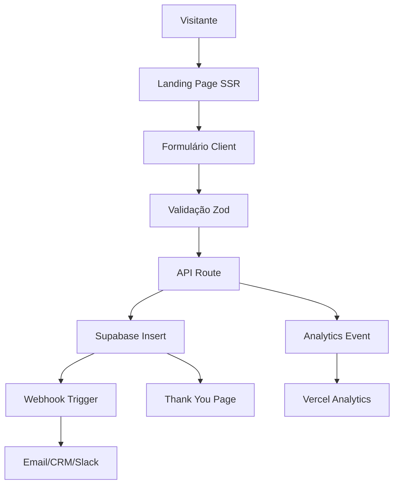

# 🚀 Estratégia de Landing Page para Captura de Leads

**Data:** 18 de outubro de 2025  
**Stack Base:** Next.js 15 + React 19 + Supabase + Vercel  
**Objetivo:** Máxima conversão com performance otimizada

---

## 📊 Análise da Stack Atual

### ✅ O que já temos e é perfeito para landing pages:

1. **Next.js 15 + React 19**
   - Server Components para performance máxima
   - App Router otimizado
   - Image Optimization nativo
   - Edge Runtime para latência mínima

2. **Supabase**
   - Database PostgreSQL (leads storage)
   - Auth (se precisar de área restrita)
   - Edge Functions (webhooks, integrações)
   - Realtime (notificações instantâneas)

3. **Framer Motion**
   - Animações premium para engajamento
   - Scroll animations
   - Micro-interactions

4. **Tailwind CSS 4**
   - Rapid prototyping
   - Dark mode nativo
   - Responsive design

5. **React Hook Form + Zod**
   - Validação client + server
   - Type-safe forms
   - Performance otimizada

6. **Vercel**
   - Edge Network global
   - A/B testing nativo (Vercel Edge Config)
   - Analytics
   - Web Vitals tracking

---

## 🎨 Arquitetura Recomendada

### 1. **Estrutura de Rotas**

```
/lp/[campaign-slug]         → Landing page dinâmica por campanha
/lp/[campaign-slug]/success → Thank you page
/api/leads/capture          → API Route para captura
/api/leads/webhook          → Webhook para integrações
```

### 2. **Fluxo de Dados**



---

## 🏗️ Implementação: Começar pelo Front ou Back?

### ✅ **RECOMENDAÇÃO: Começar pelo FRONT (MVP Visual)**

**Por quê?**
1. **Validação rápida** - Testar copy, design, CTA
2. **Feedback visual** - Stakeholders veem resultado imediato
3. **Iteração ágil** - Ajustar layout antes de backend
4. **Mock data** - Formulário pode validar sem backend

**Depois:** Backend em paralelo ou sequencial, conforme necessidade

---

## 🎯 Componentes Essenciais da Landing

### 1. **Hero Section (Above the Fold)**
```tsx
// Elementos críticos:
- Headline clara e valor único
- Sub-headline explicativa
- CTA principal visível
- Imagem/vídeo de impacto
- Trust indicators (logos, depoimentos)
- Social proof (números, métricas)
```

### 2. **Formulário de Captura**
```tsx
// Campos mínimos (menos = mais conversão):
- Nome
- Email (obrigatório)
- Telefone (opcional mas importante para qualificação)
- Campo hidden: utm_source, utm_campaign, etc
```

### 3. **Seções de Prova Social**
```tsx
- Depoimentos com foto real
- Logos de clientes
- Números de impacto (X clientes, Y resultados)
- Case studies curtos
```

### 4. **Urgência/Escassez**
```tsx
- Countdown timer (se aplicável)
- "Vagas limitadas"
- Bônus por tempo limitado
- Early bird discount
```

### 5. **FAQ Accordion**
```tsx
- Responder objeções comuns
- Reduzir fricção
- Aumentar confiança
```

---

## 🛠️ Stack Técnica Completa

### Core (Já Temos ✅)
```json
{
  "frontend": {
    "framework": "Next.js 15",
    "ui": "React 19 + Tailwind 4",
    "animations": "Framer Motion",
    "forms": "React Hook Form + Zod",
    "state": "Zustand (se necessário)"
  },
  "backend": {
    "database": "Supabase PostgreSQL",
    "api": "Next.js API Routes + Edge Functions",
    "auth": "Supabase Auth (se precisar)"
  },
  "deploy": {
    "platform": "Vercel Edge",
    "cdn": "Vercel Edge Network",
    "analytics": "Vercel Analytics + Web Vitals"
  }
}
```

### Complementos Recomendados

#### 🎯 **Alta Prioridade (Implementar Agora)**

1. **Email Marketing**
   ```bash
   # Opção 1: Resend (já temos ✅)
   pnpm add resend
   
   # Opção 2: SendGrid (mais features)
   pnpm add @sendgrid/mail
   ```

2. **Analytics e Tracking**
   ```bash
   # Google Analytics 4
   pnpm add react-ga4
   
   # Facebook Pixel
   pnpm add react-facebook-pixel
   
   # Hotjar (heatmaps)
   # Script via next/script
   ```

3. **A/B Testing**
   ```bash
   # Vercel Edge Config (nativo)
   # OU
   pnpm add @vercel/flags
   ```

4. **Formulário e Validação**
   ```bash
   # Já temos ✅
   - react-hook-form
   - zod
   
   # Adicionar:
   pnpm add react-google-recaptcha-v3  # Anti-spam
   ```

#### 📊 **Média Prioridade (Fase 2)**

5. **CRM Integration**
   ```bash
   # RD Station
   pnpm add @rdstation/rdstation-node
   
   # HubSpot
   pnpm add @hubspot/api-client
   
   # Pipedrive
   pnpm add pipedrive
   ```

6. **WhatsApp Integration**
   ```bash
   # Evolution API (já temos estrutura)
   # Notificação imediata de lead
   ```

7. **Notificações**
   ```bash
   # Slack webhook (simples e efetivo)
   pnpm add @slack/webhook
   
   # Discord (alternativa)
   pnpm add discord.js
   ```

#### 🎨 **Baixa Prioridade (Polish)**

8. **Video e Mídia**
   ```bash
   # YouTube/Vimeo embed otimizado
   pnpm add react-player
   ```

9. **Chat Widget**
   ```bash
   # Intercom, Drift, ou Tawk.to
   # Via script tag
   ```

---

## 📝 Schema do Banco de Dados

### Tabela: `leads`

```sql
CREATE TABLE leads (
  id UUID PRIMARY KEY DEFAULT gen_random_uuid(),
  created_at TIMESTAMPTZ DEFAULT NOW(),
  updated_at TIMESTAMPTZ DEFAULT NOW(),
  
  -- Dados do Lead
  name TEXT NOT NULL,
  email TEXT NOT NULL,
  phone TEXT,
  company TEXT,
  
  -- Qualificação
  lead_source TEXT, -- 'google-ads', 'facebook', 'linkedin', etc
  lead_status TEXT DEFAULT 'new', -- 'new', 'contacted', 'qualified', 'converted'
  lead_score INTEGER DEFAULT 0,
  
  -- Tracking (UTM)
  utm_source TEXT,
  utm_medium TEXT,
  utm_campaign TEXT,
  utm_content TEXT,
  utm_term TEXT,
  
  -- Campanha
  campaign_slug TEXT NOT NULL,
  landing_page_url TEXT,
  
  -- Metadata
  user_agent TEXT,
  ip_address INET,
  referrer TEXT,
  
  -- GDPR/LGPD
  consent_marketing BOOLEAN DEFAULT false,
  consent_terms BOOLEAN DEFAULT true,
  
  -- Processamento
  processed BOOLEAN DEFAULT false,
  processed_at TIMESTAMPTZ,
  sent_to_crm BOOLEAN DEFAULT false,
  crm_id TEXT,
  
  -- Indexes
  CONSTRAINT leads_email_unique UNIQUE (email, campaign_slug)
);

-- Indexes para performance
CREATE INDEX idx_leads_campaign ON leads(campaign_slug);
CREATE INDEX idx_leads_created_at ON leads(created_at DESC);
CREATE INDEX idx_leads_status ON leads(lead_status);
CREATE INDEX idx_leads_email ON leads(email);

-- RLS Policy
ALTER TABLE leads ENABLE ROW LEVEL SECURITY;

CREATE POLICY "Allow public insert" ON leads
  FOR INSERT TO anon WITH CHECK (true);

CREATE POLICY "Admins can view all" ON leads
  FOR SELECT TO authenticated USING (
    auth.jwt() ->> 'role' = 'admin'
  );
```

### Tabela: `campaigns`

```sql
CREATE TABLE campaigns (
  id UUID PRIMARY KEY DEFAULT gen_random_uuid(),
  created_at TIMESTAMPTZ DEFAULT NOW(),
  updated_at TIMESTAMPTZ DEFAULT NOW(),
  
  slug TEXT UNIQUE NOT NULL,
  name TEXT NOT NULL,
  description TEXT,
  
  -- Config da Landing
  hero_title TEXT NOT NULL,
  hero_subtitle TEXT,
  cta_text TEXT DEFAULT 'Começar Agora',
  
  -- Tracking
  total_views INTEGER DEFAULT 0,
  total_leads INTEGER DEFAULT 0,
  conversion_rate DECIMAL(5,2) GENERATED ALWAYS AS (
    CASE 
      WHEN total_views > 0 THEN (total_leads::DECIMAL / total_views) * 100
      ELSE 0
    END
  ) STORED,
  
  -- Status
  is_active BOOLEAN DEFAULT true,
  start_date TIMESTAMPTZ,
  end_date TIMESTAMPTZ,
  
  -- A/B Testing
  variant TEXT DEFAULT 'A' -- 'A', 'B', 'C'
);
```

---

## 🚀 Plano de Implementação (3 Fases)

### **FASE 1: MVP Front-End (1-2 dias)**

**Objetivo:** Landing page funcional visualmente perfeita

```bash
1. Criar estrutura de rotas
   ├─ /lp/[slug]/page.tsx
   ├─ /lp/[slug]/success/page.tsx
   └─ components/landing/

2. Implementar componentes core
   ├─ HeroSection.tsx
   ├─ LeadForm.tsx
   ├─ SocialProof.tsx
   ├─ FAQ.tsx
   └─ Footer.tsx

3. Animações e micro-interactions
   └─ Framer Motion + scroll triggers

4. Validação client-side
   └─ React Hook Form + Zod

5. Mock de captura (console.log)
```

**Resultado:** Landing testável para validar design/copy

---

### **FASE 2: Backend + Captura (1 dia)**

**Objetivo:** Captura real de leads com notificações

```bash
1. Setup Supabase
   ├─ Criar tabelas (leads, campaigns)
   ├─ Configurar RLS
   └─ Testar insert manual

2. API Route de captura
   ├─ /api/leads/capture
   ├─ Validação server-side (Zod)
   ├─ Insert no Supabase
   └─ Error handling

3. Thank you page dinâmica
   └─ Success state + redirect

4. Notificações imediatas
   ├─ Email (Resend)
   ├─ Slack webhook
   └─ WhatsApp (opcional)

5. Analytics básico
   └─ Log eventos no Vercel Analytics
```

**Resultado:** Sistema de captura 100% funcional

---

### **FASE 3: Integrações + Otimização (2-3 dias)**

**Objetivo:** CRM integration, tracking avançado, A/B testing

```bash
1. Google Analytics 4 + Facebook Pixel
   └─ Tracking de conversões

2. CRM Integration
   ├─ RD Station / HubSpot
   └─ Sincronização automática

3. A/B Testing
   ├─ Vercel Edge Config
   └─ Variants de headline/CTA

4. Performance optimization
   ├─ Image optimization
   ├─ Lazy loading
   └─ Core Web Vitals < 2s

5. GDPR/LGPD compliance
   ├─ Cookie banner
   └─ Privacy policy
```

**Resultado:** Landing page enterprise-grade

---

## 📈 Métricas de Sucesso

### KPIs Principais
```yaml
Performance:
  - LCP: < 2.5s
  - FID: < 100ms
  - CLS: < 0.1
  - Page Load: < 3s

Conversão:
  - Taxa de conversão: > 2% (boa), > 5% (excelente)
  - Bounce rate: < 60%
  - Tempo na página: > 1min

Qualidade:
  - Lead score médio: > 50
  - Taxa de qualificação: > 30%
  - Taxa de conversão SQL: > 10%
```

---

## 🎨 Exemplo de Componente: Hero + Form

```tsx
// app/lp/[slug]/page.tsx
'use client';

import { useState } from 'react';
import { useForm } from 'react-hook-form';
import { zodResolver } from '@hookform/resolvers/zod';
import { z } from 'zod';
import { motion } from 'framer-motion';

const leadSchema = z.object({
  name: z.string().min(2, 'Nome muito curto'),
  email: z.string().email('Email inválido'),
  phone: z.string().optional(),
  consent: z.boolean().refine(val => val === true, {
    message: 'Você precisa aceitar os termos'
  })
});

type LeadFormData = z.infer<typeof leadSchema>;

export default function LandingPage({ params }: { params: { slug: string } }) {
  const [isSubmitting, setIsSubmitting] = useState(false);
  
  const { register, handleSubmit, formState: { errors } } = useForm<LeadFormData>({
    resolver: zodResolver(leadSchema)
  });

  const onSubmit = async (data: LeadFormData) => {
    setIsSubmitting(true);
    
    try {
      const response = await fetch('/api/leads/capture', {
        method: 'POST',
        headers: { 'Content-Type': 'application/json' },
        body: JSON.stringify({
          ...data,
          campaign_slug: params.slug,
          utm_source: new URLSearchParams(window.location.search).get('utm_source'),
          // ... outros UTMs
        })
      });
      
      if (response.ok) {
        window.location.href = `/lp/${params.slug}/success`;
      }
    } catch (error) {
      console.error('Erro ao enviar:', error);
    } finally {
      setIsSubmitting(false);
    }
  };

  return (
    <div className="min-h-screen bg-gradient-to-br from-slate-950 to-slate-900">
      {/* Hero Section */}
      <section className="relative py-20 px-4">
        <div className="max-w-4xl mx-auto text-center space-y-8">
          <motion.h1 
            initial={{ opacity: 0, y: 20 }}
            animate={{ opacity: 1, y: 0 }}
            className="text-5xl font-bold text-white"
          >
            Transforme seu negócio em 90 dias
          </motion.h1>
          
          <motion.p 
            initial={{ opacity: 0 }}
            animate={{ opacity: 1 }}
            transition={{ delay: 0.2 }}
            className="text-xl text-slate-300"
          >
            Sistema completo de gestão imobiliária com IA integrada
          </motion.p>

          {/* Form */}
          <motion.div
            initial={{ opacity: 0, y: 20 }}
            animate={{ opacity: 1, y: 0 }}
            transition={{ delay: 0.4 }}
            className="max-w-md mx-auto bg-white/10 backdrop-blur-xl rounded-2xl p-8 border border-white/20"
          >
            <form onSubmit={handleSubmit(onSubmit)} className="space-y-4">
              <input
                {...register('name')}
                placeholder="Seu nome"
                className="w-full px-4 py-3 rounded-lg bg-white/5 border border-white/10 text-white placeholder:text-slate-400"
              />
              {errors.name && (
                <p className="text-red-400 text-sm">{errors.name.message}</p>
              )}

              <input
                {...register('email')}
                type="email"
                placeholder="Seu melhor email"
                className="w-full px-4 py-3 rounded-lg bg-white/5 border border-white/10 text-white placeholder:text-slate-400"
              />
              {errors.email && (
                <p className="text-red-400 text-sm">{errors.email.message}</p>
              )}

              <input
                {...register('phone')}
                placeholder="WhatsApp (opcional)"
                className="w-full px-4 py-3 rounded-lg bg-white/5 border border-white/10 text-white placeholder:text-slate-400"
              />

              <label className="flex items-start gap-2 text-sm text-slate-300">
                <input
                  {...register('consent')}
                  type="checkbox"
                  className="mt-1"
                />
                <span>
                  Aceito receber comunicações e concordo com a{' '}
                  <a href="/privacy" className="text-teal-400 underline">
                    política de privacidade
                  </a>
                </span>
              </label>
              {errors.consent && (
                <p className="text-red-400 text-sm">{errors.consent.message}</p>
              )}

              <button
                type="submit"
                disabled={isSubmitting}
                className="w-full py-4 bg-teal-500 hover:bg-teal-600 text-white font-semibold rounded-lg transition-all disabled:opacity-50"
              >
                {isSubmitting ? 'Enviando...' : 'Quero Conhecer Agora →'}
              </button>
            </form>

            {/* Trust indicators */}
            <div className="mt-6 pt-6 border-t border-white/10 text-center space-y-2">
              <p className="text-xs text-slate-400">
                🔒 Seus dados estão seguros
              </p>
              <p className="text-xs text-slate-400">
                ✓ Mais de 500 empresas confiam
              </p>
            </div>
          </motion.div>
        </div>
      </section>
    </div>
  );
}
```

---

## 🔧 API Route Exemplo

```typescript
// app/api/leads/capture/route.ts
import { NextRequest, NextResponse } from 'next/server';
import { z } from 'zod';
import { createSupabaseServerClient } from '@/lib/supabase/client';

const leadSchema = z.object({
  name: z.string().min(2),
  email: z.string().email(),
  phone: z.string().optional(),
  campaign_slug: z.string(),
  utm_source: z.string().optional(),
  utm_medium: z.string().optional(),
  utm_campaign: z.string().optional(),
  consent: z.boolean()
});

export async function POST(request: NextRequest) {
  try {
    const body = await request.json();
    const data = leadSchema.parse(body);

    const supabase = createSupabaseServerClient();

    // Insert lead
    const { data: lead, error } = await supabase
      .from('leads')
      .insert({
        name: data.name,
        email: data.email,
        phone: data.phone,
        campaign_slug: data.campaign_slug,
        utm_source: data.utm_source,
        utm_medium: data.utm_medium,
        utm_campaign: data.utm_campaign,
        consent_marketing: data.consent,
        user_agent: request.headers.get('user-agent'),
        referrer: request.headers.get('referer'),
        landing_page_url: request.headers.get('referer'),
      })
      .select()
      .single();

    if (error) throw error;

    // Trigger notifications (async, não bloqueia resposta)
    Promise.all([
      sendEmailNotification(lead),
      sendSlackNotification(lead),
      sendToWhatsApp(lead)
    ]).catch(console.error);

    return NextResponse.json({ success: true, lead });
  } catch (error) {
    console.error('Lead capture error:', error);
    return NextResponse.json(
      { error: 'Erro ao processar lead' },
      { status: 400 }
    );
  }
}
```

---

## 🎯 Conclusão e Próximos Passos

### Começar por:

1. ✅ **FRONT-END PRIMEIRO** (1-2 dias)
   - Validar design e copy rapidamente
   - Iterar com stakeholders
   - Testar usabilidade

2. ✅ **BACKEND EM PARALELO** (1 dia)
   - Enquanto design é aprovado
   - Setup Supabase
   - Preparar API Routes

3. ✅ **INTEGRAÇÃO** (meio dia)
   - Conectar form ao backend
   - Testar fluxo completo

4. ✅ **OTIMIZAÇÃO** (1 dia)
   - Performance
   - SEO
   - Analytics

### Timeline Total: **3-4 dias** para MVP production-ready

### Complementos necessários:
```bash
# Essenciais
pnpm add react-ga4 react-facebook-pixel @slack/webhook

# Recomendados
pnpm add @rdstation/rdstation-node react-google-recaptcha-v3

# Opcionais
pnpm add @hubspot/api-client react-player
```

---

**Pronto para começar?** 🚀

Sugiro criarmos:
1. O componente de landing page primeiro
2. Schema do banco em paralelo
3. API route de captura
4. Integração + testes

Quer que eu gere a estrutura de arquivos e componentes iniciais?
